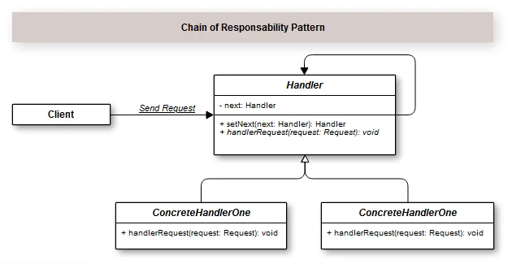
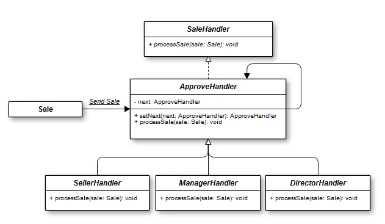

## Introduction

O Padrão de Projeto Chain of Responsability, através de uma cadeia de responsabilidades, consegue evitar dependências entre um objeto receptor e um objeto solicitante. Ou seja, um objeto fica como responsável por decidir se vai processar alguma mensagem ou a passar a responsabilidade para o próximo objeto.

A intenção do padrão Chain of Responsability está bem clara. O objeto receptor, ao receber a solicitação do remetente, vai castateando entre outros objetos até que um saiba como tratar a solicitação. Enquanto um não atender a expectativa, vai descendo e descendo. Ou seja, o objeto tratador da solicitação não é especificado explicitamente. 

