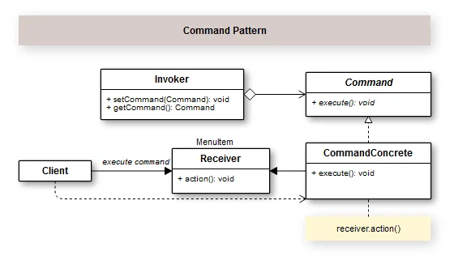

## Introduction

With use of Command design pattern, we create a manner to encapsulate requests into classes, to this requests can be sorted, linked, etc. A common use is in log and task distributor.

