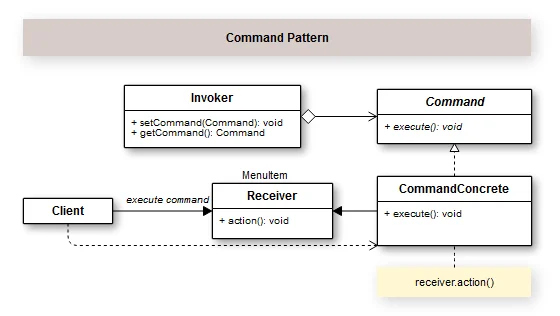

## Introduction

Com o uso do padrão Command, criamos uma maneira de encapsular requisições em classes, para que estas requisições possam ser ordenadas, enfileiradas, etc. Um uso muito comum é em logs e em distribuição de tarefas.

