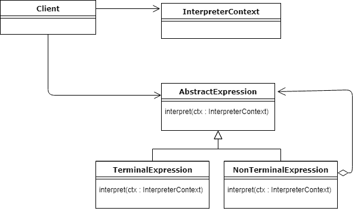

## Introduction

The Interpreter pattern is designed to interpret sentences in a language. It involves defining a representation for the language's grammar alongside an interpreter to process this grammar. This pattern is particularly useful when you need to design a tool that interprets or compiles languages, offering a structured approach to translating one form of data into another.

sample: https://www.oodesign.com/interpreter-pattern 
