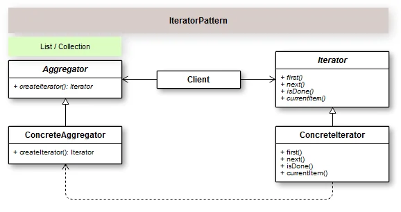

## Introdução
Um Iterator serve para dar acesso aos elementos de uma coleção ou agregado sem expor sua implementação interna. Exemplos desse padrão são encontrados em coleções que suportam a iteração usando o comando foreach presente em algumas linguagens de programação.

Com o uso do Padrão de Projeto Iterator, conseguimos acessar e percorrer elementos em uma coleção de dados sem expor sua implementação. Ou seja, não importa se é uma lista, pilha ou uma árvore, etc…Conseguimos acessar sequencialmente os elementos de um objeto agregado sem expor sua representação subjacente. Refinando um pouco mais esse conceito, o padrão Iterator literalmente assume a responsabilidade de acessar os elementos sequencialmente da coleção e transfere essa responsabilidade  para o objeto Iterator.

O Padrão Iterator  define prioritariamente duas interfaces, uma para representar a coleção de dados, o Aggregator, e outra para definir as regras de acesso aos elementos da coleção, o Iterator.

É muito fácil encontrar um exemplo para utilizar o Padrão Iterator, só pensar em alguma coleção de dados qualquer e implementar o recurso para percorrer os seus elementos. Por exemplo, vamos criar um agregador de tarefas.