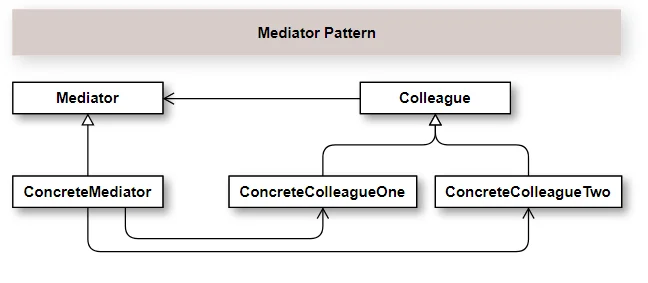
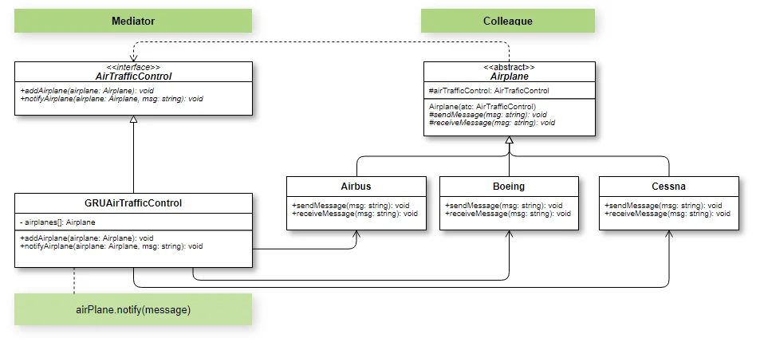

## Introdução

O Padrão de Projeto Mediator é muito utilizado quando temos muitos relacionamentos entre objetos. Com isso, ele assume o comando e faz a mediação entre os  objetos. Ou seja, ele restringe as comunicações diretas entre os objetos e mediador entra em ação para assumir essa responsabilidade.

Um excelente exemplo para exemplificar o uso deste padrão. Pense em um aeroporto, por exemplo, o de Guarulhos (GRU) em São Paulo. Temos vários aviões que trafegam e precisam em algum momento se comunicarem para estarem em sincronismo para não gerar acidentes ou imprevistos. Só que imagina 10 aviões ao mesmo tempo tendo comunicação direta entre os pilotos. Tudo isso geraria um caos. Por este motivo, eles têm o controlador de tráfego aéreo que faz o papel de Mediator e controla a comunicação entre as aeronaves.

### Vantagens e desvantagens do Padrão Mediator

Como você pode perceber, o Single Responsibility Principle (SRP) é um ponto forte deste pattern além do é Open Closed Principle (OCP) que nos dá facilidade em introduzir novos mediadores assim como novos Collegues sem comprometer o que já existe.

No meu ponto de vista a principal desvantagem deste padrão é que você delega muita responsabilidade para um indivíduo mediador. Isso pode aumentar sua complexidade e o transformar em um God Object. De toda forma, sabemos que nada é perfeito. Então, usando com sabedoria temos bons frutos com o uso deste pattern.