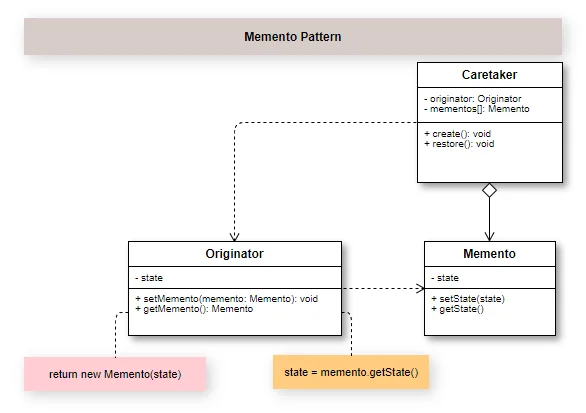

## Introduction

Memento is used to externalize the object state without rape the encapsulation, so to be able to restore previously state. It is worth mentioning that each object owner your self attributes in your respective classes, what define the object state are the values it was assigned to him.

