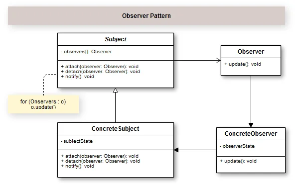

## Introduction

The Observer design pattern creates a relationship of a notifier object and many objects that are observing it to receive their notifications when the state of this notifier object changes.Simply put, the Observer pattern allows an object notify other objects on changes in its state.

