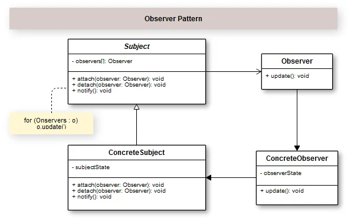

## Introduction

O Padrão de Projeto Observer cria um relacionamento de um objeto notificador e muitos objetos que ficam observando-o para receber suas notificações quando o estado deste objeto notificador mudar.  Simplificando, o padrão Observer permite que um objeto notifique outros objetos sobre alterações em seu estado.

