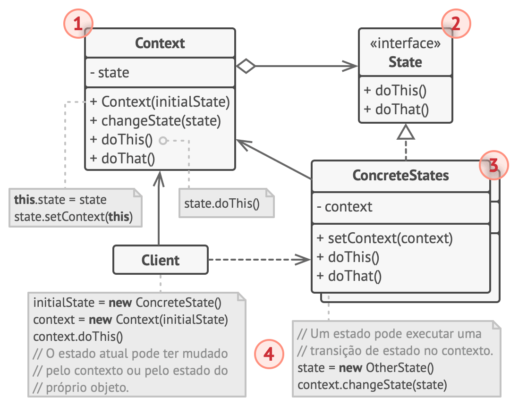

## Introdução

O State é um padrão de projeto comportamental que permite que um objeto altere seu comportamento quando seu estado interno muda. Parece como se o objeto mudasse de classe.

Essa estrutura pode ser parecida com o padrão Strategy, mas há uma diferença chave. No padrão State, os estados em particular podem estar cientes de cada um e iniciar transições de um estado para outro, enquanto que estratégias quase nunca sabem sobre as outras estratégias.

### Analogia com o mundo real
Os botões e interruptores de seu smartphone comportam-se de forma diferente dependendo do estado atual do dispositivo:

- Quando o telefone está desbloqueado, apertar os botões leva eles a executar várias funções.
- Quando o telefone está bloqueado, apertar qualquer botão leva a desbloquear a tela.
- Quando a carga da bateria está baixa, apertar qualquer botão mostra a tela de carregamento.

### Estrutura

1 - O Contexto armazena uma referência a um dos objetos concretos de estado e delega a eles todos os trabalhos específicos de estado. O contexto se comunica com o objeto estado através da interface do estado. O contexto expõe um setter para passar a ele um novo objeto de estado.

2 - A interface do Estado declara métodos específicos a estados. Esses métodos devem fazer sentido para todos os estados concretos porque você não quer alguns dos seus estados tendo métodos inúteis que nunca irão ser chamados.

3 - Os Estados Concretos fornecem suas próprias implementações para os métodos específicos de estados. Para evitar duplicação ou código parecido em múltiplos estados, você pode fornecer classes abstratas intermediárias que encapsulam alguns dos comportamentos comuns.

Objetos de estado podem armazenar referências retroativas para o objeto de contexto. Através dessa referência o estado pode buscar qualquer informação desejada do objeto contexto, assim como iniciar transições de estado.

4 - Ambos os estados de contexto e concretos podem configurar o próximo estado do contexto e realizar a atual transição de estado ao substituir o objeto estado ligado ao contexto.

## Aplicabilidade

 Utilize o padrão State quando você tem um objeto que se comporta de maneira diferente dependendo do seu estado atual, quando o número de estados é enorme, e quando o código estado específico muda com frequência.