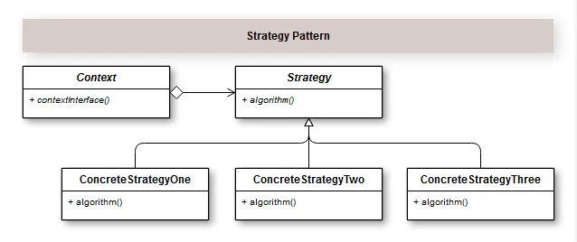

## Introdução

 Padrão Strategy permite definir novas operações sem alterar as classes dos elementos sobre os quais opera. Ou seja, ele encapsula um algoritmo em um objeto e através de uma interface, conseguimos fazer a troca(intercâmbio) entre os algoritmos concretos que implementam os métodos definidos na interface.

