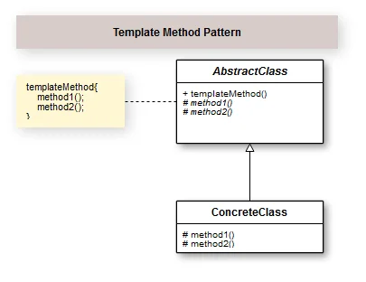

## Introdução

O Padrão de Projeto Template Method cria uma estrutura de algoritmo dentro de um método, de modo que alguns passos que vão estar contidos neste método, seja transferido a responsabilidade para suas classes filhas.  Ou seja, o Template Method divide um algoritmo em passos, e efetua a chamada desses passos ou etapas em um método específico que será utilizado como template.

O Template Method é um padrão de projeto relativamente simples. Por esta razão é  bastante utilizado pelos programadores.  Observe que o uso de métodos abstratos, reforça o Open Closed Principle (OCP), que diz que uma classe deve ser aberta para extensões e fechada para alterações.Porém, tome cuidado para não ferir o Princípio da substituição de Liskov (LSP), que nos diz que temos que reforçar a consistência para que a classe pai ou sua classe filha possam ser usadas da mesma maneira sem erros. Ou seja, analise bem  o problema para não gerar consequências como estas listadas a seguir em sua modelagem das classes:

Sobrescrever/implementar um método que não faz nada;
Retornar valores de tipos diferentes da classe base;
Disparar uma exceção inesperada, etc..
Vou citar um exemplo de violão, imagine que vai ter alguma pizza que não assa, você come ela crua (é apenas um exemplo), então literalmente a classe filha estaria obrigada a implementar este método abstrato, só que não faria sentido.  De resto, é um bom pattern para algumas situações em nossos projetos. 