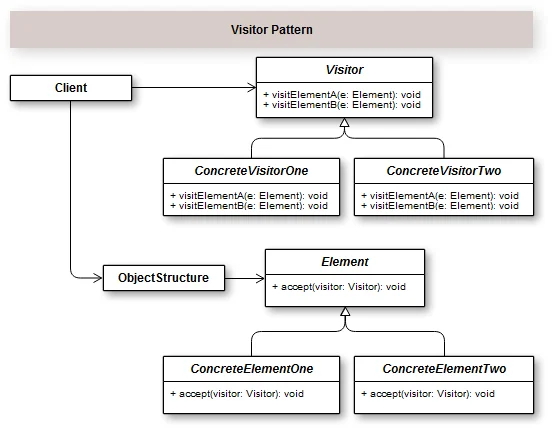

## Introduction

The visitor pattern has its intention very objective and clear.It represents an operation to be performed on the elements of an object structure.That is, it can define a new operation on a particular element without changing the classes on which these elements operate.

sample: https://growthcode.com.br/design-pattern/padrao-de-projeto-visitor-em-php-com-exemplo/
