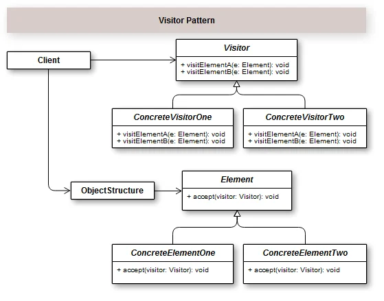

## Introduction

O Padrão Visitor tem sua intenção bem objetiva e clara. Ele representa uma operação a ser executada nos elementos de uma estrutura de objetos. Ou seja, ele consegue definir uma nova operação em um determinado elemento sem mudar as classes sobre as quais esses elementos operam.

sample: https://growthcode.com.br/design-pattern/padrao-de-projeto-visitor-em-php-com-exemplo/
