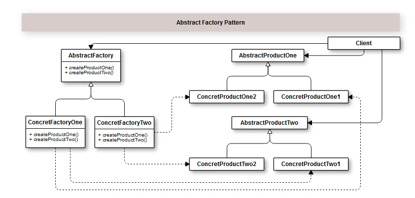

# Introdução

O Padrão de Projeto Abstract Factory é utilizado quando queremos criar uma família e objetos relacionados sem necessariamente especificar suas classes concretas. Ou seja, criarmos diferentes tipos de contratos utilizando métodos abstratos ou interfaces, para diferentes produtos para garantir que as classes concretas não serão chamadas diretamente. Isso entra em consonância com o SRP (Single Responsibility Principle).

