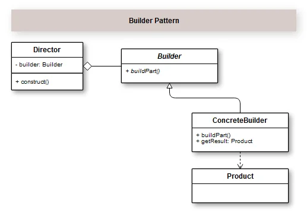

## Introdução

O Padrão de Projeto Builder é muito útil quando você tem objetos complexos que precisam ser criados parte a parte. Ou seja, você tem a estrutura da classe e consegue criar os objetos como se fossem um passo a passo. 

O padrão Builder  é composto por quatro componentes básicos que são: a Interface (ou classe abstrata) Builder, o Concrete Builder (construtor concreto), o Director (Diretor) e o Product (produto).

Resumidamente Director é responsável por chamar o método de construção do Builder, que chama sua implementações especializadas, Concrete Builder, que possui em sua implementação a lógica para construir nossa classe final que é o Product;

No seu dia a dia como programador, você vai encontrar situações em que você precisará criar uma classe que vai representar a construção de um determinado objeto, só que esse objeto terá pequenas partes, o que os tornam complexos, no sentido de muitas partes. Haverá também situações em que você vai precisar criar uma instância desse objeto, porém não vai precisar carregar todas as suas características.

Como normalmente era feita esta implementação? Criava-se um objeto com um construtor enorme, com permissão para  entradas com valores null, ou valores default também nulos. E na instanciação, desconsiderava o que precisava. Em algumas linguagens como Java, permite criar múltiplos construtores o que facilitava um pouco neste quesito, porém, utilizando o padrão Builder o resultado esperado é mais desejável.

Observando bem os participantes, veja que temos apenas propriedades que geram as características do modelo e os métodos para atribuir e retornar os seus valores. Com isso, você consegue facilmente modelar o Padrão de Projeto Builder de forma diferente e ter o mesmo resultado.

No Livro Java Efetivo do Joshua Bloch ele trás um exemplo super inteligente de uso do Padrão Builder utilizando em combinação com o padrão Static Method Factory (uma alternativa ao uso dos construtores) com uma peculiaridade de utilizar uma classe aninhada.

Como o PHP não permite este recurso, de classes aninhadas, fiz uma variação utilizando Trait e classe anônima, que vai produzir o mesmo efeito. Vamos encapsular as propriedades e métodos e acesso aos valores na classe BurderTrait para ser utilizado, tanto na classe Burger quanto na BurguerBuilder