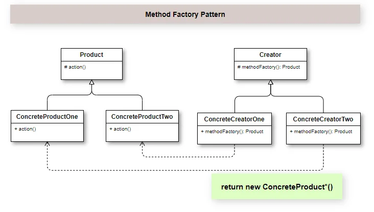

## Introdução

Uma das das necessidades mais comuns do mundo da programação é a necessidade de criar instâncias ou conjuntos de objetos dinamicamente. Porém, em alguns cenários, você tem uma estrutura pronto, que pode ser utilizada para criar novas instâncias com estruturas similares. É aí que entram as classes que representam, como se fossem fábricas.

Através do Padrão de Projeto Factory Method, temos uma interface e suas implementações, e a partir de uma classe factory é decidido qual instância utilizar. Sua representação em diagrama de classe da UML nos dá uma ótima visão 

