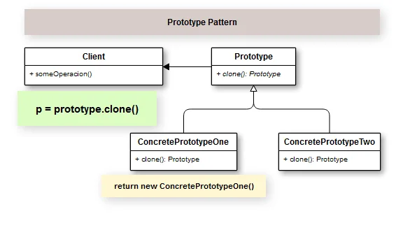

## Introdução

Quando queremos criar um protótipo que nos permitirá copiar objetos sem ter que gerar uma nova classe para isso. Ou seja, nós conseguimos clonar objetos através de cópias de um protótipo de classe.

A ideia central do Padrão Prototype é firmar um contrato através de uma interface, onde as classes que se especializarem nesta habilidade, de serem protótipos, possam implementar a capacidade de gerar um clone de si.

