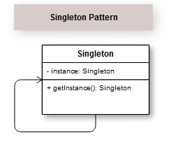

## Introdução

O Padrão Singleton é utilizado quando queremos que exista só uma única instância de uma classe e que ela possa ser facilmente acessível de qualquer ponto do programa. É uma boa alternativa às variáveis globais e as classes que só possuem métodos estáticos. Em um Singleton, a própria classe é responsável por gerenciar sua única instância.

A representação do Padrão de Projeto Singleton utilizando o diagrama de classes da UML é bastante simples e intuitivo no seu entendimento.

