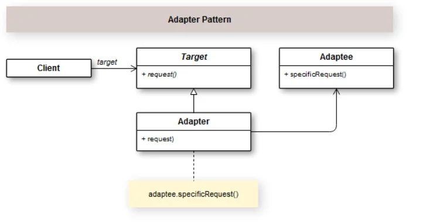

## Introdução

O Padrão de Projeto Adapter tem a finalidade  de criar literalmente um adaptador entre objetos. Ele converte a interface de um objeto para a interface esperada por um cliente. Ou seja, ele consegue fazer com que objetos incompatíveis consigam ficar intercambiáveis e possam se comunicar efetivamente. Você vai encontrar o termo Wrapper para se referir ao padrão Adapter.

Existem diversas situações em que você precisará criar um adaptador. Sobretudo quando você estiver lidando com sistemas legados, por exemplo, utilizando classes que trabalharão na camada intermediária entre a aplicação cliente e a biblioteca em si. 

Existem muitos exemplos que podemos aplicar o padrão Adapter. Para ficar bem didático e simples, vamos criar um adaptador de moedas. A ideia é que não importa o input se for dólar ou euro (adaptee), sempre vai gerar o valor em real. Com isso, nosso alvo (target) será a conversão dos valores para real. 