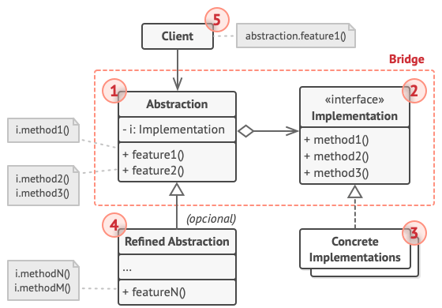

## Introdução

O Bridge é um padrão de projeto estrutural que divide a lógica de negócio ou uma enorme classe em hierarquias de classe separadas que podem ser desenvolvidas independentemente.

Neste exemplo, a hierarquia da classe Page atua como a Abstração, e a hierarquia da Renderer atua como a Implementação. Objetos da classe Page podem montar páginas da web de um tipo específico usando elementos básicos fornecidos por um objeto Renderer anexado a essa página. Como as duas hierarquias de classes são separadas, você pode adicionar uma nova classe Renderer sem alterar nenhuma das classes Page e vice-versa.

[Ler mais](https://refactoring.guru/pt-br/design-patterns/bridge)