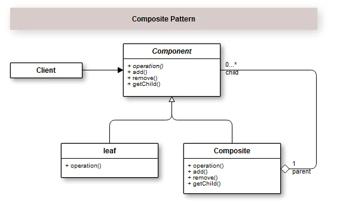
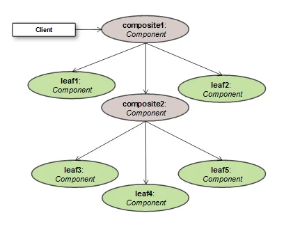

## Introdução

O Padrão Composite é um padrão estrutural que nos permite criar objetos em estruturas individuais ou compostas similares a uma árvore. Onde cada objeto, tanto individual (leaf) como composto(composite), serão tratados da mesma forma. Em outras palavras, você consegue criar componentes que ignoram as diferenças entre objetos  individuais ou compostos.

Quando me refiro a componentes compostos, é que o padrão Composite faz a ligação hierárquica ligando vários objetos a um único através da recursividade. Ou seja, ele permite que você componha objetos em uma estrutura similar a um árvore para representar hierarquias todo-parte.

Certamente em algum momento você teve que manipular HTML. Se você observar, ele carrega todos os princípios do padrão Composite. Ele tem tags, como  ou <h1></h1> que representam a leaf e outras tags que que conseguem adicionar outras em uma estrutura hierarquizada como uma árvore, como exemplo a tag 
 que pode receber diversas outras tags, etc…

A nossa classe para representar nosso componente principal será TagComponent. Seguido da classe Tag que representa leaf e da classe TagComposite.

[Tutorial aqui](https://growthcode.com.br/design-pattern/padrao-de-projeto-composite-em-php-com-exemplo/)