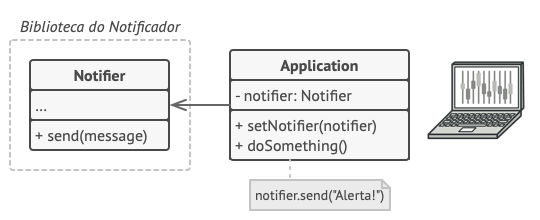

## Introdução

O Decorator é um padrão estrutural que permite adicionar novos comportamentos aos objetos dinamicamente, colocando-os dentro de objetos wrapper especiais.

Usando decoradores, você pode agrupar objetos inúmeras vezes, pois os objetos de destino e os decoradores seguem a mesma interface. O objeto resultante terá um comportamento de empilhamento de todos os wrappers.

Neste exemplo, o padrão Decorator ajuda a criar regras complexas de filtragem de texto para limpar o conteúdo antes de renderizá-lo em uma página da web. Diferentes tipos de conteúdo, como comentários, postagens no fórum ou mensagens privadas, exigem diferentes conjuntos de filtros.

Por exemplo, embora queira excluir todo o HTML dos comentários, você ainda pode manter algumas tags HTML básicas nas postagens do fórum. Além disso, convém permitir a publicação no formato Markdown, que deve ser processado antes da filtragem de HTML. Todas essas regras de filtragem podem ser representadas como classes decorador separadas, que podem ser empilhadas de maneira diferente, dependendo da natureza do conteúdo que você possui.

[Ver mais](https://refactoring.guru/pt-br/design-patterns/decorator/php/example#example-1)