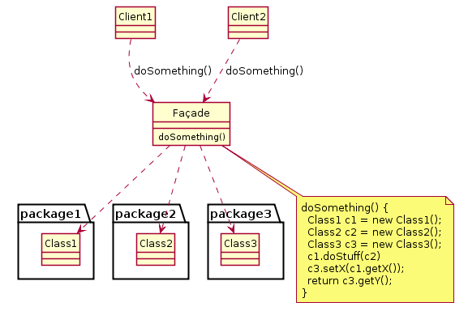

## Introdução

Fornecer uma interface unificada para um conjunto de interfaces em um subsistema.
Façade define uma interface de nível mais alto que torna o subsistema mais fácil de  ser usado.
Estruturar um sistema em subsistemas ajuda a reduzir a complexidade. Um objetivo comum de todos os projetos é minimizar a comunicação e as dependências entre subsistemas. Uma maneira de atingir esse objetivo é introduzir um objeto facade (fachada), o qual fornece uma interface única e simplificada para os recursos e facilidades mais gerais de um subsistema. Padrões de Projeto: Soluções reutilizáveis de software orientado a objetos, pág. 179, Editora Bookman 2008. 

