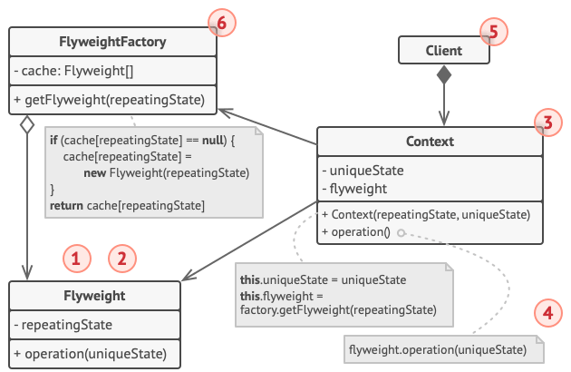

## Introdução

O Flyweight é um padrão de projeto estrutural que permite a você colocar mais objetos na quantidade de RAM disponível ao compartilhar partes comuns de estado entre os múltiplos objetos ao invés de manter todos os dados em cada objeto.

1 - O padrão Flyweight é somente uma optimização. Antes de aplicá-lo, certifique-se que seu programa tem mesmo um problema de consumo de RAM relacionado a existência de múltiplos objetos similares na memória ao mesmo tempo. Certifique-se que o problema não possa ser resolvido por outra forma relevante.

2 - A classe Flyweight contém a porção do estado do objeto original que pode ser compartilhada entre múltiplos objetos. O mesmo objeto flyweight pode ser usado em muitos contextos diferentes. O estado armazenado dentro de um flyweight é chamado “intrínseco”. O estado passado pelos métodos flyweight é chamado “extrínseco”.
3
 - A classe Contexto contém o estado extrínseco, único para todos os objetos originais. Quando um contexto é pareado com um dos objetos flyweight, ele representa o estado completo do objeto original.

4 - Geralmente, o comportamento do objeto original permanece na classe flyweight. Nesse caso, quem chamar o método do flyweight deve também passar os dados apropriados do estado extrínseco nos parâmetros do método. Por outro lado, o comportamento pode ser movido para a classe contexto, que usaria o flyweight meramente como um objeto de dados.

5 - O Cliente calcula ou armazena o estado extrínseco dos flyweights. Da perspectiva do cliente, um flyweight é um objeto modelo que pode ser configurado no momento da execução ao passar alguns dados de contexto nos parâmetros de seus métodos.

6 - A Fábrica Flyweight gerencia um conjunto de flyweights existentes. Com a fábrica os clientes não precisam criar flyweights diretamente. Ao invés disso, eles chamam a fábrica, passam os dados de estado intrínseco para o flyweight desejado. A fábrica procura por flyweights já criados e então retorna um existe que coincide o critério de busca ou cria um novo se nada for encontrado.

