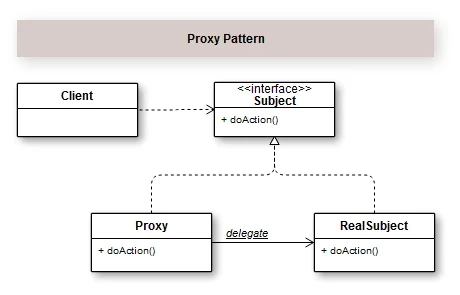

## Introdução

Com o Padrão de Projeto Proxy você consegue controlar o acesso a um objeto de modo a prover somente as funções permitidas a um determinado cliente.  Ou seja, ele encapsula um objeto que possui a mesma implementação de interface de um segundo objeto, chamado proxy, que controla o acesso ao primeiro.  

Certamente em algum momento você esbarrou em algum Proxy de internet. Como poderíamos representar essa implementação, por exemplo, de controle de conexão com a internet?

A estrutura de uso deste padrão neste exemplo de controle de conexão, o contrato do Subject fica sendo a ação de conexão a um determinado site. Ou seja, se o site estiver na lista de negados, disparará uma exceção. Caso contrário, aparecerá uma mensagem com o sucesso da conexão.